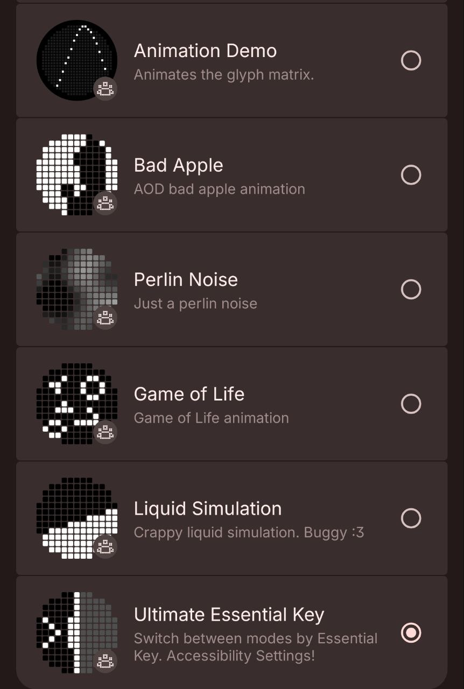

Glyph GeekBox
====================

About the App
--------------
This project is a collection of Glyph Matrix toys and tools:
- `animation` demo which shows an indefinite animation until the toy is deactivated
- `Bad Apple` - AOD bad apple animation
- `Perlin Noise` - Just a perlin noise animation
- `Game of Life` - Conway's Game of Life
- `Liquid Simulation` - Physics-based liquid simulation
- `Ultimate Essential Key` - Switch between modes using the Essential Key

After going through the `Setup` stage in this document the project can be run on the device.
> Tip: `Short-press` the `Glyph Button` to navigate between the toys.

The project utilizes the GlyphMatrix SDK to interact with the device's Glyph interface.

This app is written in Kotlin and utilizes a `GlyphMatrixService.kt` wrapper for easier SDK integration.

Requirements
--------------
Android Studio, Kotlin, compatible device with Glyph Matrix

