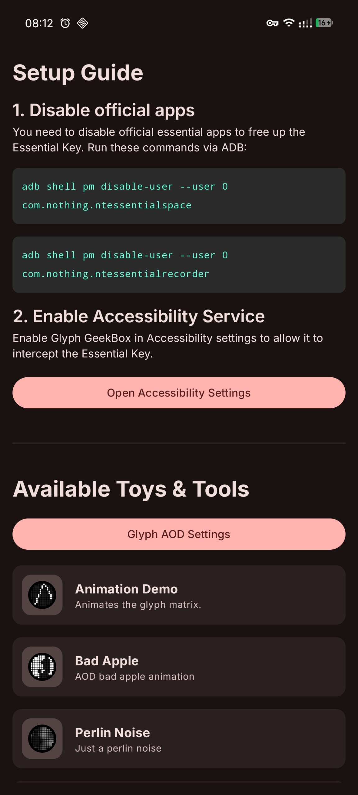
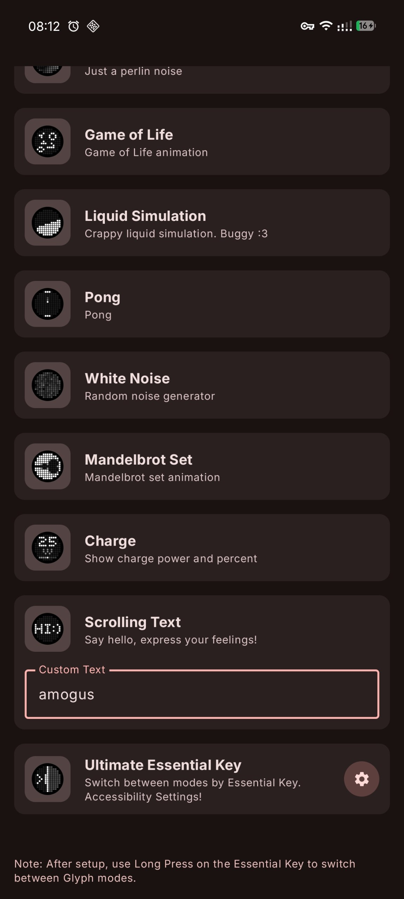
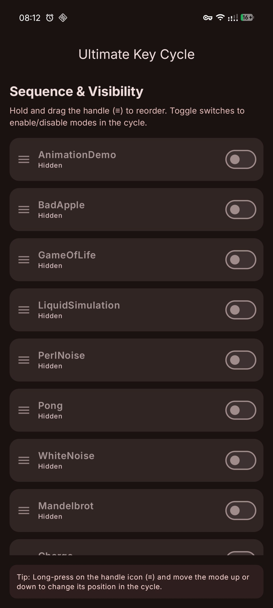
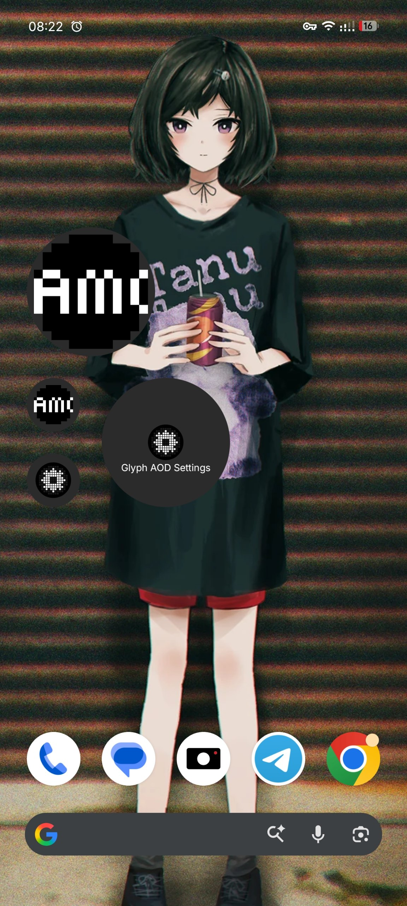
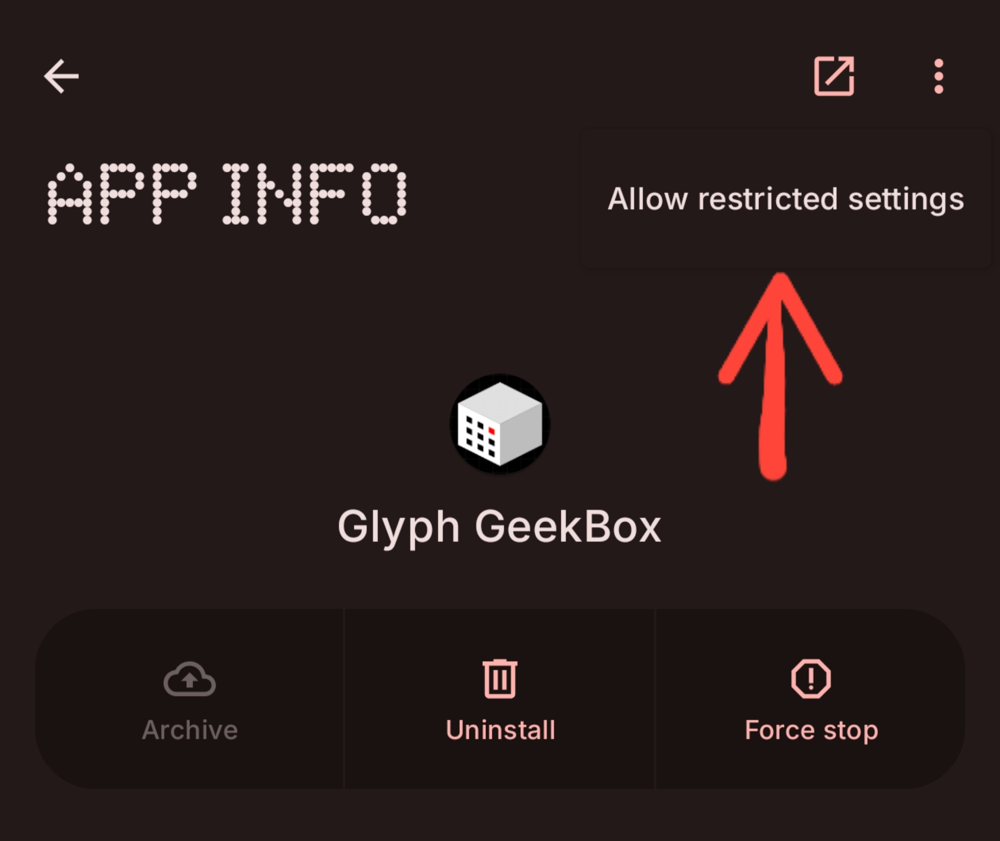
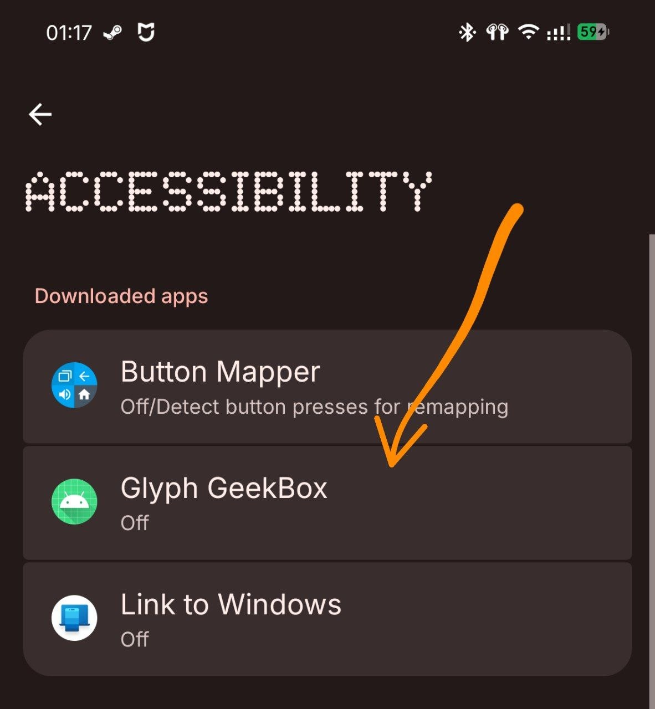
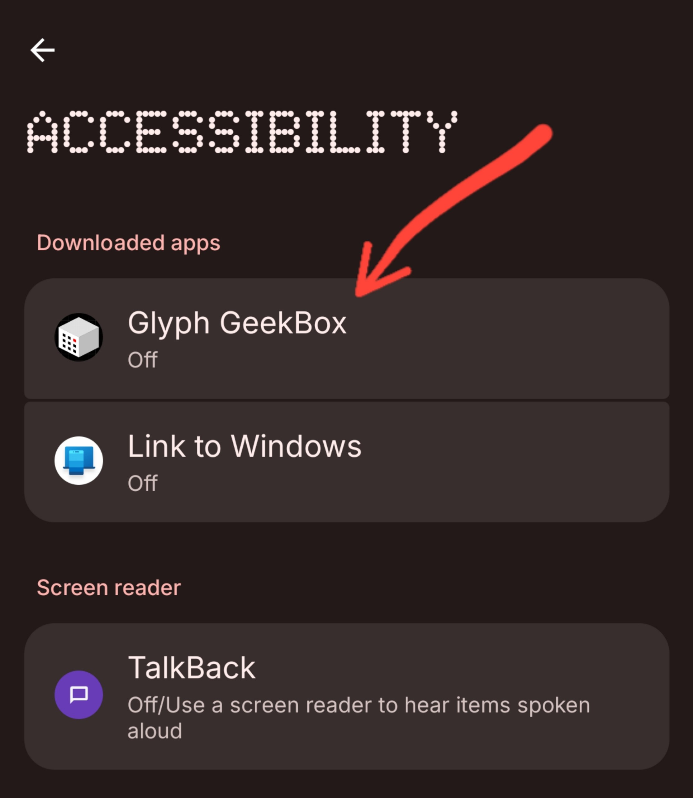
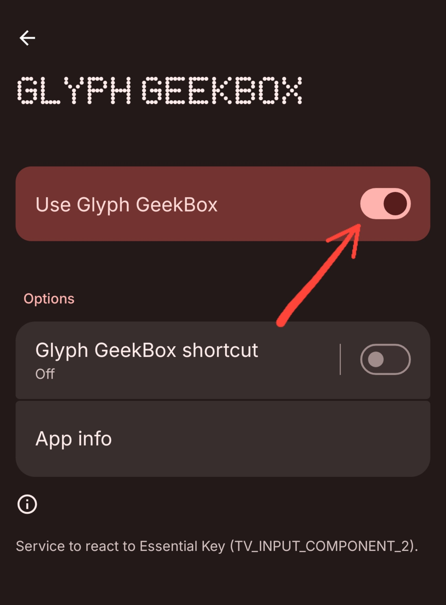

Glyph GeekBox
====================


Target: Nothing Phone 4a pro

About the App
--------------
This project is a collection of Glyph Matrix toys and tools:
- `animation` demo which shows an indefinite animation until the toy is deactivated
- `Bad Apple` - AOD bad apple animation
- `Perlin Noise` - Just a perlin noise animation
- `Game of Life` - Conway's Game of Life
- `Liquid Simulation` - Physics-based liquid simulation
- `Mandelbrot` - Mandelbrot set visualization
- `White Noise` - Random white noise animation
- `Ultimate Essential Key` - Switch between modes using the Essential Key
- `Pong` - circular pong game
- `Charge` - show charging wattage and percent when unplugged
- `Scrolling Text` - Say hello, express your feelings!
- `Analog Clock` - 2 types of analog clock

<p align="center">




</p>

<video src="https://github.com/user-attachments/assets/85f60a60-66a6-4fd9-8905-6e2827bd5ed0"></video>

# Ultimate Essential Key

1. You need to disable official essential apps to free up the Essential Key:
```shell
adb shell pm disable-user --user 0 com.nothing.ntessentialspace
adb shell pm disable-user --user 0 com.nothing.ntessentialrecorder
```

2. Enable this app in Accessibility settings to allow it to intercept the Essential Key:

<p align="center">
  
  
  
  
</p>
